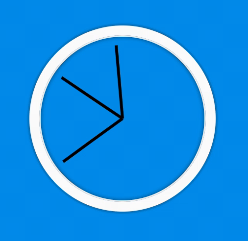

# JS and CSS Clock

## Table of contents

- [General info](#general-info)
- [Technologies](#technologies)
- [Setup](#setup)
- [Code Overview](#Code-Overview)
- [Sources](#Sources)

## General info

This app using HTML and CSS animation to show real time clock



## Technologies

Project is created with:

- JavaScript ES6
- HTML 5 & CSS

## Setup

To run this project, download entier package and open it in web browser or

Clone this repo to your desktop and run npm install to install all the dependencies.

## Code Overview

### Summary

1. Animate the clock hand with css
2. get the real time by rotating clock hand to the ring degree

## JavaScript Function explain

1. A function to call out every second

   > setInterval(setDate, 1000)

2. Make new function call setDate

   > function setDate() {}

3. Create variable hold the js date object `new Date()` and get the seconds of the date

   > const now = new Date()
   > const seconds = now.getSeconds()

   The getSeconds() method returns the seconds (from 0 to 59) of the specified date and time.

   convert 0-59 to degree

   > const secondsDegree = ((seconds / 60) \* 360) + 90;

4. Add the clculation style to HTML `.style`, `.transform`, `rotate(${secondsDegree}deg)`

```
const secondHand = document.querySelector('.second-hand');

secondHand.style.transform = `rotate(${secondsDegree}deg)`;

```

## HTML layout

Creating 2 div tags to wrape all hr, min, sec "hand"

```
  Clock
    --Clok-face
            ----hand : hr
                       min
                       second
```

```
<div class="clock">
    <div class="clock-face">
      <div class="hand hour-hand"></div>
      <div class="hand min-hand"></div>
      <div class="hand second-hand"></div>
    </div>
  </div>
```

## CSS style

> transform: translateY(-3px)

Move the element up 3px from original position

> transform-origin: 100%;

transform-origin where the orgin of rotatin from. by defaul is 50%, the middle of element

> transform: rotate()

When div clreated, the position by default will be horizontal from left to righ. We want the clock hand start form 12 o'clock which vertical line. To do that, we can rotate the element 90deg

`transform: rotate(90deg);`

> transition: all 0.05s

timing on movement speed with changeing rotation degree

> transition-timing-function: cubic-bezier(0.1, 2.7, 0.58, 1);

movement methods

- cubic-bezier(x, x, x, x)

* ease-in-out

## Sources

[JavaScript30](https://javascript30.com) is a free crouse provided by [Wes Bos](https://github.com/wesbos)
